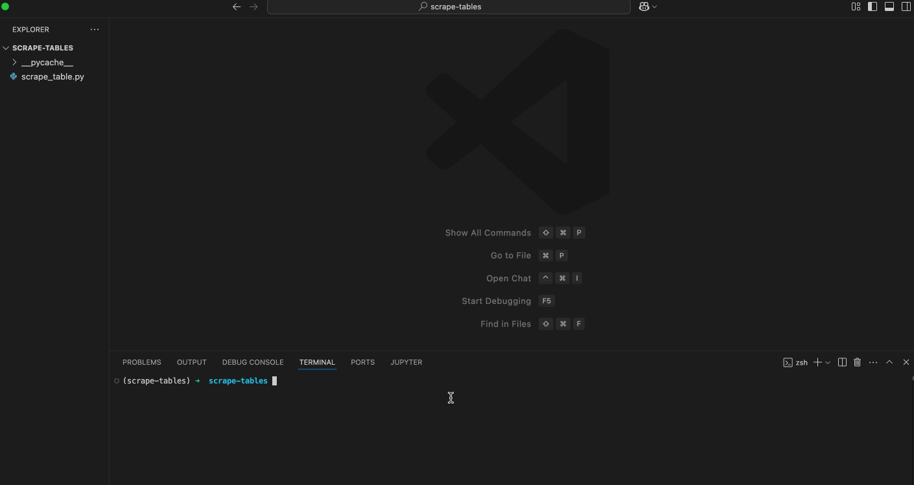
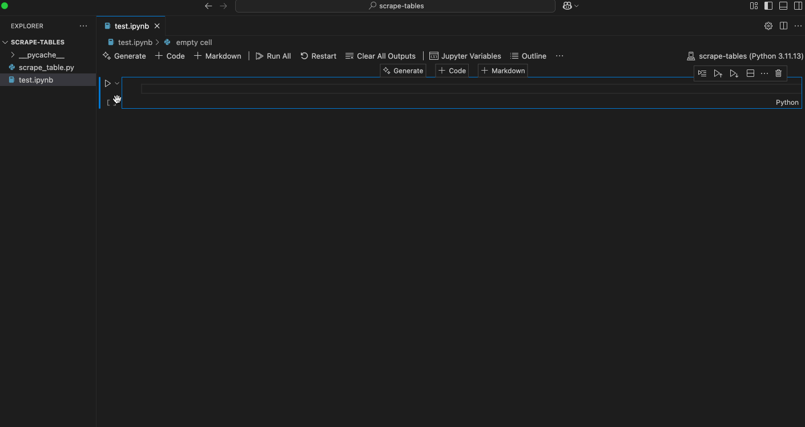

# Scrape Tables From Webpages
This guide provides an alternative solution when the pandas `pd.read_html()` function fails to scrape tables from web pages. You can execute the script in two ways:
1. On the command line: `python3 scrape_tables.py --url='your_url.com'`. Here is an example:

2. In a Jupyter notebook environment with the following example:

## Requirements
- Python 3.11 (`conda create -n 'scrape-tables' python=3.11`)
- Required packages (`pip install -r requirements.txt`)